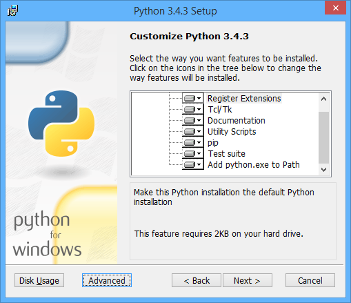

====================
 Pyramid TODO app
====================

Setup
====================

Install Python
--------------------

Windows
~~~~~~~~~~~~~~~~~~~~

Open a command prompt and type ``python --version``. You should see something like this::

    C:\Users\Me>python --version
    Python 3.4.3

If you do not have Python 3.4 installed, download the Windows installer from `python.org
<http://www.python.org/>`_

When you are running the Windows installer, make sure to select "Register Extensions" and "Add python.exe to the Path". Note that this will change the default Python on your system to Python 3.4.

After you have installed Python 3.4, open a new command prompt and type ``python --version``. You should now see that Python is installed and ready.

On Windows 8 and 8.1, there is a quick keyboard shortcut for opening a new command prompt - Win-x, then c. 

The regular Windows command prompt (``cmd.exe``) will work fine for this class, but if you want a nicer command line interface, I recommend `cmder <http://gooseberrycreative.com/cmder/>`_. It looks better, and has some useful extras.

Pip
~~~~~~~~~~~~~~~~~~~~

Python comes with a package manager called ``pip``. This is used to automatically install the dependencies for a project, usually from the `Python Package Index <https://pypi.python.org/pypi>`_. The Python Package Index is abbreviated PyPI, and is affectionately known as the "Cheeseshop".

Virtualenv
~~~~~~~~~~~~~~~~~~~~

We will be using virtual environments to isolate the projects we are working on. The advantage of using virtual environments is that we can work on multiple projects, and not have their dependencies interfere with each other. For example, we can work on a Django 1.6 project and a Django 1.7 project, without conflicts.

To achieve this, virtualenvs have the concept of "activation". When a virtualenv is activated, only the packages installed in that virtualenv are available to the Python interpreter. There are two ways of activating a virtualenv: interactively, or by path.

Interactive activation::

    C:\Users\Me>C:\PythonEnvs\my_virtual_env\Scripts\activate.bat
    (my_virtual_env)C:\Users\Me>
